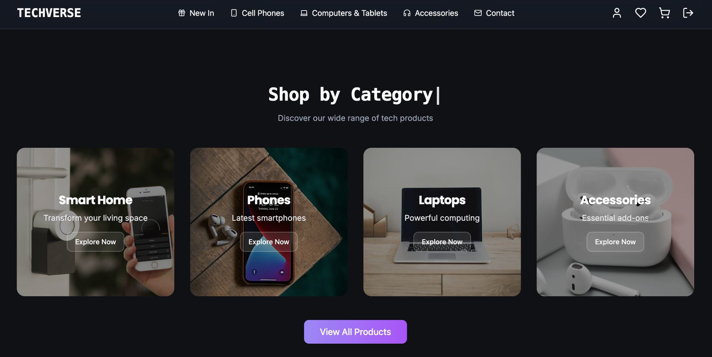

<div align="center">
  

  # TECHVERSE
  
  ### 🚀 Your Gateway to Tomorrow's Technology

  [](https://app.netlify.com/#)
  
  
  
  
</div>

## 🌟 Overview

TECHVERSE is a cutting-edge e-commerce platform specializing in the latest technology products. From smartphones to laptops, and smart home devices to essential accessories, we bring the future of technology to your fingertips.

## ✨ Features

- 🔐 **Secure Authentication** - Protected routes and user management
- 🛍️ **Smart Shopping** - Intuitive product categorization and search
- 🛒 **Seamless Cart Management** - Real-time updates and easy checkout
- 💳 **Secure Payments** - Protected transaction processing
- 📱 **Responsive Design** - Perfect experience across all devices
- 🎨 **Modern UI/UX** - Built with Tailwind CSS and shadcn/ui

## 🚀 Tech Stack

- **Frontend Framework:** React with TypeScript
- **Build Tool:** Vite
- **Styling:** Tailwind CSS + shadcn/ui
- **Backend Services:** Supabase
- **State Management:** TanStack Query
- **Deployment:** Netlify

## 🛠️ Getting Started

1. **Clone the repository**
```bash
git clone <your-repo-url>
cd techverse
```

2. **Install dependencies**
```bash
npm install
```

3. **Set up environment variables**
Create a `.env` file in the root directory:
```env
VITE_SUPABASE_URL=your_supabase_url
VITE_SUPABASE_ANON_KEY=your_supabase_anon_key
```

4. **Start the development server**
```bash
npm run dev
```

5. **Build for production**
```bash
npm run build
```

## 📱 Product Categories

- 📱 **Phones** - Latest smartphones and mobile devices
- 💻 **Computers & Tablets** - Powerful computing solutions
- 🎧 **Accessories** - Essential add-ons and peripherals
- 🏠 **Smart Home** - Connected living solutions

## 🌐 Deployment

This project is configured for seamless deployment on Netlify. The `netlify.toml` file includes all necessary build configurations and redirects for optimal performance.

## 🤝 Contributing

1. Fork the repository
2. Create your feature branch (`git checkout -b feature/AmazingFeature`)
3. Commit your changes (`git commit -m 'Add some AmazingFeature'`)
4. Push to the branch (`git push origin feature/AmazingFeature`)
5. Open a Pull Request

## 📄 License

This project is licensed under the MIT License - see the [LICENSE](LICENSE) file for details.

## 🙏 Acknowledgments

- [React](https://reactjs.org/)
- [Vite](https://vitejs.dev/)
- [Tailwind CSS](https://tailwindcss.com/)
- [shadcn/ui](https://ui.shadcn.com/)
- [Supabase](https://supabase.com/)
- [Netlify](https://www.netlify.com/)

---

<div align="center">
  Made with ❤️ by the TECHVERSE team
</div>